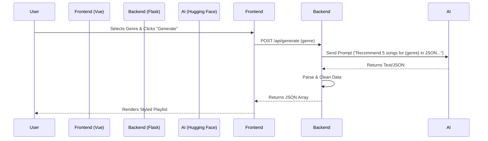

# Project Planning: Music Playlist Generator

## 1. Project Overview

**Goal:** Develop a web application that generates song playlists based on a selected music genre using AI.
**Assignment Context:** This project is a full-stack web application requiring a separation of concerns between a Frontend (UI) and a Backend (API), integrated with a simpler text-generation AI service.

## 2. Requirements Analysis

### 2.1. Functional Requirements

- **User Interface:**
  - A dropdown menu for users to select a music genre (e.g., Pop, Jazz, Rock, Lo-Fi, Classical).
  - A "Generate Playlist" button.
  - A display area to show the generated playlist (5 songs: Title + Artist) in a styled list.
- **Backend API:**
  - A single endpoint (e.g., `POST /api/generate-playlist`) that accepts a `genre`.
  - Integration with a Text Generation API (e.g., Hugging Face Inference API) to fetch recommendations.
  - Returns a structured JSON response containing 5 songs.
- **System:**
  - Frontend must communicate with Backend via API.
  - Bonus: Bash script to start the server and show logs.

### 2.2. Non-Functional Requirements

- **Code Quality:** Clean, modular code structure.
- **Aesthetics:** High-quality, modern design (as per development standards).
- **Run-ability:** Easy local setup with clear instructions.

## 3. Technology Stack Selection

To meet the requirements while ensuring a premium, modern feel:

### Frontend

- **Framework:** **Vue.js 3** (using Vite).
  - _Reasoning:_ Meets the "Vue.js" requirement. Vue is excellent for single-page applications (SPA), offering reactivity and component modularity. Vite ensures fast development.
- **Styling:** **Vanilla CSS** (Scoped).
  - _Reasoning:_ Allows for custom, high-end "rich aesthetics" without the constraints of a utility library, ensuring the "Wow" factor with custom gradients and animations.
- **State Management:** Vue Reactivity API (`ref`, `reactive`).

### Backend

- **Language:** **Python**.
- **Framework:** **Flask**.
  - _Reasoning:_ Lightweight and perfect for a single-endpoint microservice. Easy to set up and deploy.
- **HTTP Client:** `requests` or `httpx` (for calling the AI API).
- **CORS:** `flask-cors` to allow communication with the Vue frontend.

### AI Integration

- **Provider:** **Hugging Face Inference API** (Free Tier).
- **Model:** `Qwen/Qwen2.5-7B-Instruct` or `mistralai/Mistral-7B-Instruct-v0.2`.
  - _Reasoning:_ Reliable instruction-following models available for free, easy to prompt for JSON-formatted output.

## 4. Architecture & Data Flow



## 5. Detailed Implementation Plan

### Phase 1: Project Setup & Structure

- Initialize Git repository.
- Create directory structure:
  ```
  /music-playlist-generator
  ├── /backend        # Python Flask API
  ├── /frontend       # Vue.js App
  ├── /docs           # Documentation
  ├── README.md       # Setup Instructions
  ├── start.sh        # Bonus Bash Script
  └── .gitignore
  ```

### Phase 2: Backend Development (Python)

1.  **Environment Setup**: Create `venv`, install `flask`, `flask-cors`, `requests`, `python-dotenv`.
2.  **API Construction**:
    - Create `app.py`.
    - Define endpoint `POST /api/generate-playlist`.
    - Implement error handling (try/except for API failures).
3.  **AI Integration**:
    - Construct a robust prompt system to ensure the AI returns **only** structured data (e.g., "Return a JSON list of 5 songs...").
    - Implement fallback logic (mock data) in case the external API is down (graceful degradation).
4.  **Testing**: Use Postman/Curl to verify the endpoint returns valid JSON.

### Phase 3: Frontend Development (Vue.js)

1.  **Initialization**: `npm create vite@latest frontend -- --template vue`.
2.  **Design System**:
    - Define a color palette (Dark mode, neon accents, gradients).
    - Global styles in `style.css` (reset, typography).
3.  **Component Architecture**:
    - `GenreSelector.vue`: Dropdown component.
    - `GenerateButton.vue`: Button with loading state/animation.
    - `PlaylistDisplay.vue`: List component with transition effects for items appearing.
    - `App.vue`: Orchestrator.
4.  **Integration**:
    - Use `fetch` or `axios` to call the local Flask backend.
    - Handle "Loading" and "Error" states visually.

### Phase 4: Polish & "Bonus" Tasks

1.  **Aesthetics**: Add glassmorphism effects to containers, hover effects on list items, and a dynamic background.
2.  **Bash Script (`start.sh`)**:
    - Script to launch both backend (background process) and frontend (dev server) simultaneously.
    - Trap `SIGINT` to kill both processes on exit.

### Phase 5: Documentation

1.  **README.md**:
    - Prerequisites (Node, Python).
    - Installation commands.
    - Usage guide.
2.  **Comments**: Docstrings in Python, prop definitions in Vue.

## 6. UI/UX Strategy (The "Wow" Factor)

- **Theme**: Cyberpunk/Synthwave or Modern Clean Dark.
- **Background**: Animated mesh gradient or subtle particle effect.
- **Interactions**:
  - Button: Glow effect on hover, ripple on click.
  - List: Staggered entry animation (items slide in one by one).
- **Typography**: Sans-serif, geometric font (e.g., 'Inter' or 'Outfit').

## 7. Deliverables Checklist

- [ ] Source Code (Frontend + Backend).
- [ ] `README.md` with setup steps.
- [ ] `requirements.txt` (Backend).
- [ ] `package.json` (Frontend).
- [ ] `start.sh` (Launcher script).
- [ ] `docs/planning.md` (This document).
